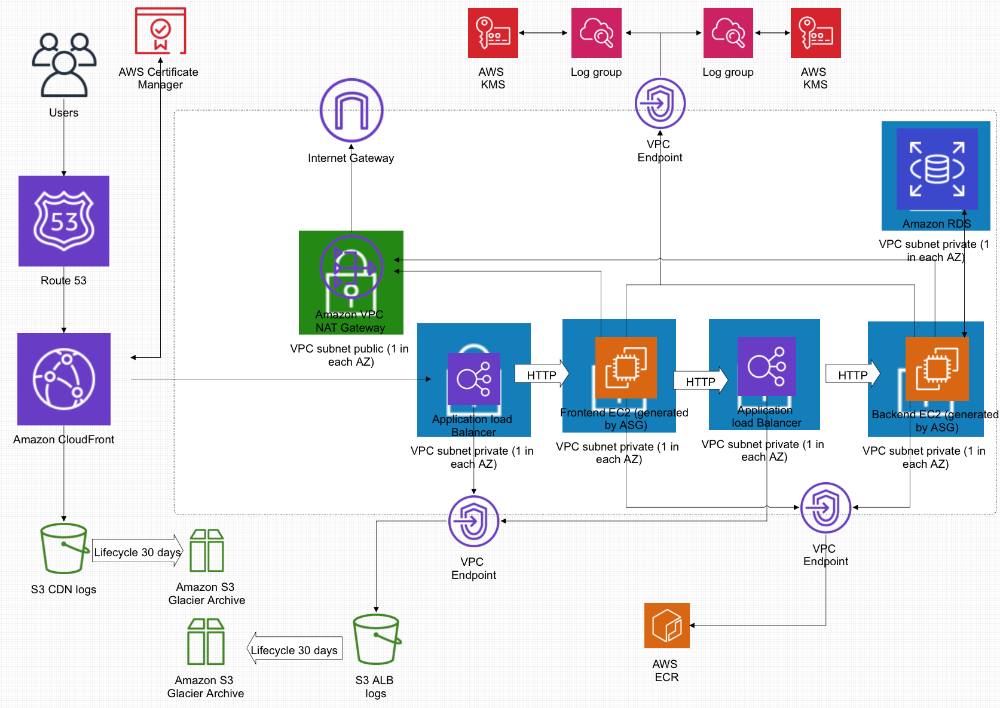

## Project Summary
This project demonstrates a production-grade, high-availability web infrastructure on AWS, fully automated using Terraform and GitHub Actions.
It showcases skills in cloud architecture, Infrastructure as Code, CI/CD pipelines, container orchestration (ECS), and AWS best practices for scalability, security, and cost efficiency.

This project showcases a highly available, scalable, and secure AWS architecture, fully provisioned using Terraform.
It demonstrates cloud infrastructure engineering best practices for a real-world production-grade environment.

The stack includes ECS, EC2 Auto Scaling, ALBs, RDS, CloudFront, Route 53, ACM, S3, and KMS, designed for fault tolerance, performance, and maintainability.

## Terraform Setup

1. Bootstrap (Manual Step)

The terraform-bootstrap/ directory contains Terraform code to:

- Create an S3 bucket to store the Terraform remote state
- Configure the necessary IAM permissions for GitHub Actions
- Set up the state backend used by all future Terraform runs

⚠️ Important:
This directory must be run manually once before using the GitHub pipelines.
After bootstrap, all other Terraform operations are automated via CI/CD.

2. Pipelines
✅ Pipeline 1 – Infrastructure Deployment (infrastructure_pipeline.yml)

- Automatically provisions all AWS infrastructure (VPC, ALBs, ECS, RDS, S3, etc.)
- Runs terraform init, plan, and apply
- Stores and retrieves Terraform state from the bootstrap S3 backend
- Uses GitHub OIDC to authenticate securely to AWS

🧩 Pipeline 2 – Application Deployment (TODO) (app_deployment_pipeline.yml)

Will:

- Run tests on the app
- Build and push a Docker image to Amazon ECR
- Automatically update the ECS service with the new image version
- Intended to demonstrate a zero-downtime CI/CD release flow

## Key Components

- **Route 53 & CloudFront:** Global DNS and CDN for fast, secure content delivery.
- **ACM (AWS Certificate Manager):** Manages TLS/SSL certificates for HTTPS traffic.
- **VPC with Multi-AZ setup:** Ensures redundancy and high availability.
- **Public Subnets:** Host Internet Gateways and NAT Gateways for outbound access.
- **Private Subnets:** Contain compute resources and databases, fully isolated for security.
- **ECS / EC2 (Auto Scaling Groups):** Application containers and backend services scale automatically.
- **Application Load Balancers (ALB):** Distribute HTTP traffic to frontend and backend EC2s.
- **Amazon RDS (MySQL):** Managed relational database for persistent data storage.
- **Amazon S3:** Used for CDN and ALB logs with lifecycle policies to Glacier Archive.
- **VPC Endpoints:** Enable private access to AWS services (S3, ECR, CloudWatch) without internet exposure.
- **AWS KMS:** Encrypts sensitive resources and CloudWatch Logs.

## Current Status / TODO

Some configurations are intentionally incomplete to keep the setup free-tier friendly.

- Fix minor ECS/ASG/Security Group dependency issues
- Add NAT Gateway configuration
- Clean up unused IAM policies in ecs_iam.tf
- Implement and test the App Deployment Pipeline (ECR + ECS update)
- Enable Route 53 & ACM resources once a custom domain is purchased 

## Notes for Reviewers

This project demonstrates:

- Infrastructure-as-Code (IaC) using Terraform
- Modular, reusable design
- GitHub Actions CI/CD pipelines with OIDC auth
- AWS best practices (private subnets, encryption, ALBs, HA design)
- Cost-conscious configuration (caches API calls with cdn)

The setup currently uses CloudFront’s default domain for HTTPS access to avoid paid domain registration.
All commented-out sections in the Terraform code can be re-enabled to support a custom domain later.

## License

You’re free to use, modify, or extend this setup for your own projects or learning.
If you deploy it with a paid domain, follow the comments in the Terraform files for configuration guidance.
